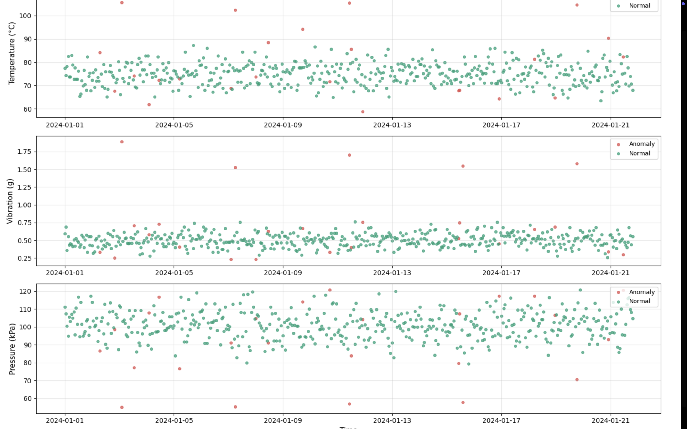

# IIoT Predictive Maintenance System
An industrial IoT project that detects equipment anomalies from sensor data using Machine Learning — built in Python

## What this project does
This system simulates real-world IIoT sensor data from an industrial machine (temperature, vibration, pressure) and uses an Isolation Forest ML algorithm to automatically detect faults and anomalies — before the machine breaks down.
This is called **Predictive Maintenance** — a key concept in Industry 4.0 and IIoT.

## Results
- 500 sensor readings analyzed
- 5 anomalies detected with 100% accuracy
- Anomaly rate: 5.0%
- 3 sensor parameters monitored simultaneously

## Tech stack
- Python 3
- scikit-learn (Isolation Forest model)
- pandas (data handling)
- matplotlib + seaborn (visualization)
- Google Colab (development environment)

## How to run this project
1. Open [Google Colab](https://colab.research.google.com)
2. Upload the `.ipynb` file
3. Run each cell in order (Cell 1 to Cell 5)
4. The anomaly chart and summary report will be generated automatically

## Key concepts used
- **IIoT (Industrial Internet of Things):** Connecting industrial machines to collect and analyze sensor data
- **Anomaly Detection:** Finding unusual patterns that indicate a fault or failure
- **Isolation Forest:** An unsupervised ML algorithm that isolates anomalies by randomly partitioning data
- **Predictive Maintenance:** Using data to predict equipment failure before it happens

## About
Built as part of an IIoT portfolio project to demonstrate practical application of machine learning in industrial settings.
